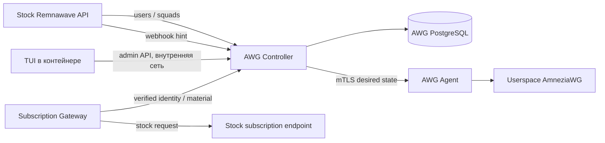

# Архитектура Remnawave AWG Extension v1

Источник требований: [MASTER_PROMPT.md](MASTER_PROMPT.md). Этот документ задаёт
целевую архитектуру; наличие описанного компонента не доказывает его готовность.
Обязательная матрица исполнения и проверки находится в [implementation-plan.md](implementation-plan.md).

## Границы и стек

Python 3.12, FastAPI, Pydantic v2, psycopg 3, cryptography. Управление — терминальное (TUI, Textual),
приложение в контейнере, обращающееся только к Controller API. Все зависимости,
build, migrations и tests исполняются в Docker. Host предоставляет Docker/Compose
и инструменты редактирования; установка project packages на host запрещена.



Stock backend, Node, Xray и PostgreSQL не меняются. Extension не получает
credentials Remnawave PostgreSQL и не подключается к её сети. Adapter обращается
только к документированным API; webhooks ускоряют reconcile, но не заменяют API.
Никаких optional frontend patches в обязательном deployment.

## Ownership данных

Remnawave владеет user UUID, identity, status/expiry, squads, subscription identity,
Xray nodes и Xray usage. Controller хранит только нормализованный cache этих
данных, не создаёт вторую систему пользователей. Удаление cache не удаляет user
в Remnawave. Все extension foreign keys к Remnawave — стабильные UUID.

AWG PostgreSQL принадлежит Controller: profiles, nodes, deployments, peer
assignments, encrypted client keys, allocations, revisions, traffic ledger,
tombstones, reconciliation metadata. Gateway/TUI не подключаются к БД напрямую.
Agent владеет server private key, runtime state и persistent apply journal;
Controller получает только server public key. Один client keypair на user —
explicit default policy; key generation позволяет ротацию без смены identity.

Client keys шифруются AEAD с external master key/key ID. Master key, API tokens,
mTLS credentials и server keys не хранятся в Git, logs, traces или metrics.
Backup AWG PostgreSQL без encryption key недостаточен для восстановления.

## Контракты

Единый источник — `packages/contracts/awg_contracts/models.py`, импорт
`awg_contracts`. Wire JSON snake_case, UUID, revision integer >= 1, UTC timestamps.
Экспортируемые JSON Schema 2020-12 и OpenAPI 3.1 — `packages/contracts/v1/`.
Endpoint table, retry/digest semantics — `packages/contracts/README.md`.

Agent протокол v1.0 требует strict schema и negotiated protocol compatibility.
AWG protocol version отличается от management protocol и версии binary.
Unknown AWG adapter/features запрещают Apply. Registry не объявляет поддержку
AWG 3/3.1, INCY, Throne или Mihomo без upstream evidence и fixtures/tests именно
для поддерживаемой версии. Формат Clash/Sing-box не является capability.

Controller management API живёт под `/api/v1`; browser admin auth отличается от
gateway service credential. `/v1/internal/subscriptions/material` принимает
subscription token, самостоятельно resolve short UUID через official API и
возвращает материал только активного пользователя. Public client не выбирает
UUID пользователя и не получает raw material endpoint.

## Desired / actual и reconciliation

Deployment соответствует `(node_id, profile_id)` и одному runtime interface.
В v1 один profile имеет один endpoint и выбирает ровно одну ноду при Validate/Apply;
draft может пока не иметь ноды. Для нескольких нод создаются отдельные profiles
с одинаковыми entitlement selectors. Это исключает выдачу разных server keys для
одного endpoint. Один client keypair пользователя может использоваться на этих profiles.
Controller сериализует reconciliation посредством PostgreSQL locks; unique
constraints защищают allocations и peer assignments при конкурентных событиях.
Доступ разрешён, если profile/node enabled, user ACTIVE и не expired/limited,
и user явно выбран либо входит хотя бы в один выбранный Internal Squad.
Пустые selectors не означают доступ всем.

DesiredDeployment — immutable полный peer set с монотонной revision и canonical
SHA256 digest. Повторное вычисление без изменений не генерирует новые ключи/IP
или revision. Webhook вызывает authoritative lookup/reconcile; дубль безвреден.
Incomplete pagination, timeout, 5xx или malformed snapshot не означают удаления.
Удаление требует authoritatively absent user, tombstone и acknowledgment всех
затронутых Agents. Offline Agent сохраняет работу, а Controller — desired state.

IPAM резервирует server/network/broadcast, выделяет адрес транзакционно и
запрещает duplicate live leases. IPv6 допускается при capability support.
Освобождение адреса проходит quarantine; недоступная нода со старым peer не
позволяет переиспользовать его адрес. Conflict pools/ports/interfaces между
deployments на одной ноде запрещены до runtime mutation.

## Revision lifecycle

```text
DRAFT → schema/semantic/IPAM/endpoint/capabilities validation
      → Agent compile/dry-run → VALIDATED → APPLYING → health → READY
                                                    ↘ ROLLING_BACK → DEGRADED/ERROR
```

Save не применяет конфиг. Agent проверяет node/path identity и digest, durable
записывает accepted revision watermark до mutation, затем применяет локально
сериализованно. Идентичный retry не создаёт новый peer. Reuse revision с другим
digest и stale revisions отвергаются. Optimistic expected applied revision
защищает stale concurrent writer. Persistent journal восстанавливается после crash.

Controller отслеживает desired, validated, applied, last-known-good revision.
READY требует healthy runtime и desired == applied; Agent online/freshness
проверяется отдельно. Health не требует handshake каждого idle пользователя.
Rollback сохраняет рабочий runtime, но применяет последний revocation overlay:
старый конфиг не может вернуть disabled/deleted/rotated peers. Filtered rollback
не равен исходной revision: applied_revision=None, state=DEGRADED, публикации нет.

Controller offline не очищает Agent. Remnawave offline сохраняет last-authoritative
state, но локально известная expiry может быть исполнена. Offline revocation
обеспечивается при reconnect; мгновенную отзывчивость недоступного Agent система
не обещает. Последний desired snapshot применяется до возвращения READY.

## Security boundary

Agent management использует mTLS: trusted CA недостаточно без проверки
назначенной controller identity. Node certificate связывается с node UUID.
Регистрация v1 использует admin API и заранее выпущенные оператором сертификаты
с SAN UUID для node identity; автоматический enrollment endpoint не требуется.
Ротация trust имеет overlap window.
Management/health/metrics разделены; public ingress не публикует Agent API.
Если TLS терминируется proxy, backend доступен только в private network и не
принимает произвольные forwarded identity headers из внешней сети.

Admin API требует независимую авторизацию и доступен только во внутренней сети расширения (TUI); веб-интерфейса нет.
Credentials не передаются в URL. Application request validation
errors очищаются от input values, так как input может содержать keys/tokens.
Agent runtime вызывает binaries argv без shell, валидирует имена interfaces и
version-specific parameter allowlists, запрещает config/control-char injection.

## Gateway и client capabilities

Gateway сначала выполняет stock request и сохраняет исходный response. Только
успешный stock auth/HWID/response-rule результат допускает AWG enrichment.
Gateway не подменяет subscription identity logic. Material содержит только
enabled, online, valid, healthy deployments с desired == applied и active peer.

При Controller/DB/renderer/capability error возвращается исходный stock response.
Сохраняются status, relevant metadata, stock entries/order, userinfo и stock
behavior. После изменения body пересчитываются Content-Length/encoding и cache
validators; старый ETag не возвращается для нового body. Ответ с private keys
не кэшируется публично и не логируется. Stock errors не превращаются в AWG успех.

Renderers: raw, Base64, Mihomo, INCY, Throne. Unknown/unsupported client получает
stock-only. Registry включает family, platform/version, supported protocol fields
и evidence. Нельзя рекламировать renderer только потому, что его output YAML
синтаксически корректен. Golden tests покрывают exact body, Unicode, escaping,
line endings, no AWG, incompatible client, malformed stock и outages.

## Traffic и quotas

Agent отдаёт cumulative peer RX/TX, latest handshake, key generation,
runtime epoch, отдельную per-peer counter epoch и sequence. Counter wire format — decimal strings. Aggregator
дедуплицирует snapshots, обнаруживает reset/decrease/rotation и сохраняет durable
deltas; reconnect и Controller restart не удваивают usage. Промежуток offline
между недоступными samples может дать недосчёт: он не превращается в invented data.

TrafficSource → TrafficAggregator → QuotaEvaluator → TrafficSink отделены.
Default sink — AWG ledger. Combined quota использует documented Xray usage плюс
AWG usage; политика может отозвать AWG, изменить status через официальный API
или уведомить администратора. Default не меняет stock user без explicit policy.
User traffic reset создаёт новый accounting period, не новые ключи/IP.

## Docker development и реальный network lab

Сети bridge: private management, synthetic underlay client↔server, target network
server↔target. Client не подключён к target network, иначе payload bypass возможен.
Base protocol tests не требуют Internet. Full/split tunnel маршруты меняются
только внутри client namespace. Userspace AWG исключает host kernel modules.
Минимальный NET_ADMIN, опциональный NET_RAW и /dev/net/tun только нужным сервисам.

Запрещены host network/PID/IPC, privileged, Docker socket, host /proc,/sys,
/lib/modules,/var/run/netns mounts. Production manifests отдельно и автоматически
на development host не запускаются. Docker bridge/veth изменения допустимы;
host default routes, policy rules, existing VPN/interfaces сохраняются.

Перед runtime network E2E обязательны structural Compose safety lint и read-only
host baseline. После cleanup сравнивается baseline. Subnet conflict проверяется
до создания networks. Host firewall не меняется project-specific командами.

Если /dev/net/tun отсутствует (выявлено при первоначальной проверке окружения),
его не создают и не загружают modules. Lab выполняется на prepared disposable VM
или isolated CI runner. В этом окружении допустимы unit/contract/DB/HTTP tests;
реальный handshake/TCP/UDP нельзя объявлять проверенным без runner evidence.

## Removal, upgrades и эксплуатация

Stock route доступен независимо от gateway. Removal переключает subscription
на stock и останавливает extension без удаления AWG DB/server-key volumes.
Возврат extension восстанавливает identity и peers через reconcile. Потеря server
key означает новую server identity и обновление client configs, не тихую подмену.
Backups включают AWG DB, encryption master key и Agent volumes, с раздельным
хранением credentials. Restore проверяется отдельно от backup command success.

AWG migrations versioned, выполняются только на AWG DB; destructive migration
требует backup/restore plan. Current/previous supported Remnawave тестируются
adapter contract suite. Неизвестный upstream DTO/version вызывает понятную
incompatible/degraded ошибку, не SQL fallback.

Liveness, readiness и dependency health различаются. Structured logs содержат
correlation ID, sanitized errors; метрики master §70 не включают secrets или
неограниченные sensitive labels. Agent/Controller restart, DB restart, webhook
loss, failed apply, duplicate events, profile update during creation и quota
changes входят в failure-injection acceptance.

## Владельцы файлов

| Agent | Ownership |
|---|---|
| architect | этот документ, implementation-plan, docs/decisions, packages/contracts, tests/contracts |
| remnawave_integrator | apps/controller, packages/remnawave-client, Controller DB migrations/tests |
| awg_node | apps/node-agent, packages/awg-config, Agent tests |
| subscription | apps/subscription-gateway, packages/subscription-renderers, packages/capabilities, golden tests |
| tui | apps/tui (терминальное управление) и tests/unit/tui |
| network_qa | deploy/dev, scripts/lab.sh, tests/integration, tests/network, tests/e2e |
| root | root dependencies/build, integration coordination, deploy/production и общая operational документация |
| reviewer | независимое чтение и findings; не подтверждает runtime по одним schemas |

Cross-component изменение начинается с согласования contracts architect,
затем consumers обновляются независимо. Shared lockfiles меняет только root.
